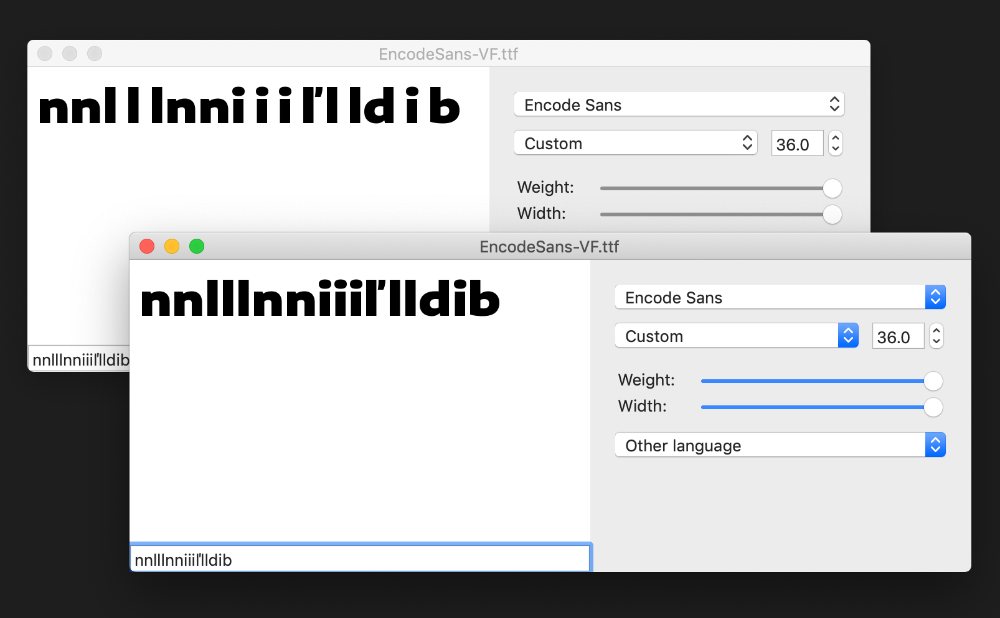

# Fixing Build Issues

Problems:

- Width values aren't being scaled to 70–130, but are rather outputting as 0–1000
- "normalized" weights are getting out of sorts – the ExtraBold is getting a value of `234` while the Black gets a value of `232`
  - the "untouched" source file appears to have been edited to have a rectangular designspace.
  - because the `fix-designspace.py` file relied on correctly-set min and max `wght` value variables, it was morphing values that were already morphed.

```
# Bold Extended and Bold Condensed original values
wghtWideMax = 232.0
wghtCondMax = 193.0
```

Steps

- [x] pull in the previous / original Encode Sans file
- [x] re-evaluate math being done to instance weight in the `fix-designspace.py` script. This shouldn't cause problems if it gets a GlyphsApp source with correct values ... but it is.
- [x] Make `fix-designspace.py` detect initial values from glyphs source, rather than relying on variables to be manually set
- [x] ~~hopefully make the code simpler? It has become pretty long and strung-together...~~ I'll refactor when/if it's needed again

Results

- The font is now once again building from the original source file.
- The `fix-designspace.py` script is detecting values, to prevent future error and be more flexible for other designs.
- The correct width values are now being placed into the file.


## Investigating kerning issue

The biggest problem so far in Encode is the output VF having unexpected kerning. An issue about this is filed at [fontmake/issues/470](https://github.com/googlei18n/fontmake/issues/470). 

With help from @mjlagattuta and @anthrotype, the issue is starting to be narrowed down. In my words from that issue:

> It seems that the values from the `/dcaron` kern1 kerning group are being moved to the normal `/d` kern1 side. Things with straight kern1 sides should be in the `/l` kern1 group, but are moved into the /d kern1 group, gaining the kerning values that should only be in the `/dcaron`.
> 
> Meanwhile, things in the `/l` kern2 group are changed to a `/b` group. I can't find any cases where this causes problems, but it's unexpected.

If static TTFs are exported, the kerning (appears to be) correct. So, I wanted to try to diff the `PairPos` tables from a static Extended Bold instance generated from the Glyphs source and an Extended Bold instance generated from the VF. 

First, I generated an Extended Bold instance from the VF with:

```
fonttools varLib.mutator dist/EncodeSans-VF-2018-10-26-17_31/EncodeSans-VF.ttf wght=900 wdth=130
```

Then, I used [xmlStarlet](http://xmlstar.sourceforge.net/) to copy the xml blocks into new files with commands like:

```
xmlstarlet sel -t -c '//PairSet' dist/EncodeSans-VF-2018-10-26-17_31/EncodeSans-VF.ttx > dist/EncodeSans-VF-2018-10-26-17_31/EncodeSans-VF-PairSet.ttx
```

and

```
xmlstarlet sel -t -c '//PairSet' dist/EncodeSans-VF-2018-10-26-17_31/EncodeSans-ExtendedBold.ttx > dist/EncodeSans-VF-2018-10-26-17_31/EncodeSans-ExtendedBold-PairSet.ttx
```

Finally, I diffed the two files with VSCode's "Compare Selected" function. It complicates matters that many of the friendly glyph names are in unicodes in the VF-generated instance. As I have also said in the issue:

> There are definitely quite a few differences, but lines referring to `/dcaron`, `/d`, `/b`, `/l`, and `/i` seem to be similar aside from their index (even though these files come from TTFs with clearly different kerning in those glyphs). So, I'm not sure if I'm comparing the right or wrong table, but if someone knows of a better ttx table to compare, please let me know. Here are those files, if it's useful:
> 
> - [59464ae/EncodeSans-VF-instance-ExtendedBold-PairSet.xml](https://github.com/thundernixon/Encode-Sans/blob/59464aed27534fee3b08752303584c539f94471d/dist/EncodeSans-VF-2018-10-26-17_31/EncodeSans-VF-instance-ExtendedBold-PairSet.xml)
> - [59464ae/EncodeSans-ExtendedBold-PairSet.xml](https://github.com/thundernixon/Encode-Sans/blob/59464aed27534fee3b08752303584c539f94471d/dist/EncodeSans-VF-2018-10-26-17_31/EncodeSans-ExtendedBold-PairSet.xml)


## Kerning issue, solved

Behdad was able to code a fix in fonttools for the kerning mixup, and Cosimo helpfully provided advice on how to install the latest fonttools code directly from the fonttools/fonttools GitHub repo. 

After installing the latest fonttools code in my virtualenv, the build process works as I want, without any further changes!



