# Visual Refinements

Like any other design project, Encode Sans has been evolved and refined over time. As good as the current version is, there are a few opportunities to make it just a little more harmonious of a design. 

Jacques Le Bailly (@fonthausen) is in NYC this week, so I took the opportunity to consult with him about a few possible changes. It was a great opportunity to understand the logic behind some of the design decisions, and to quick sketch ideas together for improvements.

## Uppercase German Double S (ẞ, Unicode 1E9E)

As of October, 2016, the `/Germandbls` had a form that was relatively unique for this glyph. I asked a couple of German friends in type design, and they agreed that it looked out-of-place. 

.

Talking with Jacques, he expressed that it should keep some of the top curvature present in letters of Encode Sans, like `/B` and `/R`. 

My first effort wasn't quite feeling right ... it was maybe a little overly-sharp at the top.

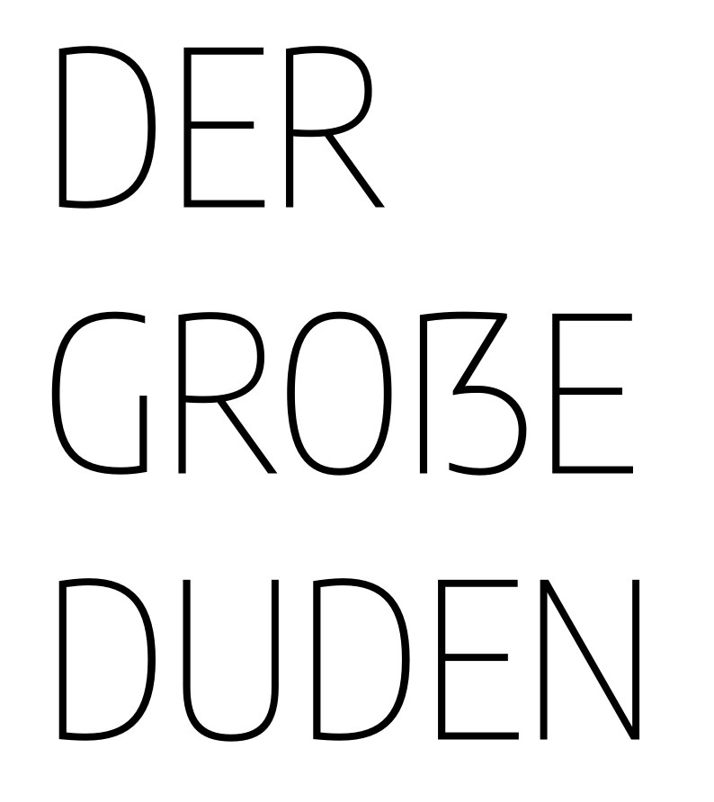

I looked for further design guidance in sources such as the [Proposal to encode Latin Capital Letter Sharp S to the UCS](http://std.dkuug.dk/jtc1/sc2/wg2/docs/n3227.pdf), a [Medium article from Christoph Koeberlin](https://medium.com/@typefacts/the-german-capital-letter-eszett-e0936c1388f8), and [design suggestions from Ralf Herrmann](https://typography.guru/journal/capital-sharp-s-designs/).

I started to see that I could keep the left part of Encode's original `/Germandbls`  so as to not make it overly-blocky. I could also borrow the top right corner of the `/Z` to make sure it followed the overall construction logic of the typeface. I feel that this form is fitting in quite well. It still needs a bit more tweaking to feel really finalized, but I like how it's looking:

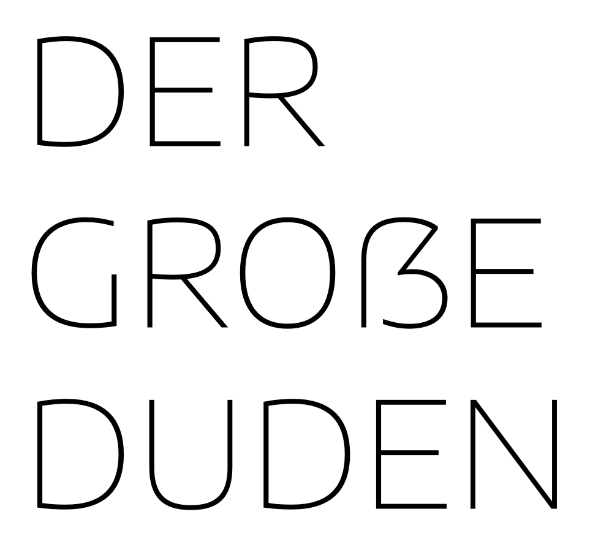

I've used [RMX Tools](https://remix-tools.com) to convert these into small caps, as well.

Later, I did a second round to combine the separate contours (keeping inner corners open), and refine the curves. I paid special attention to matching the smoothness and subtle bounce of glyphs like `/three /five /R /B`.

## Fixing the thin `/Enj.sc`

The `/Enj.sc` had a couple of interpolation errors, which were simple to fix.

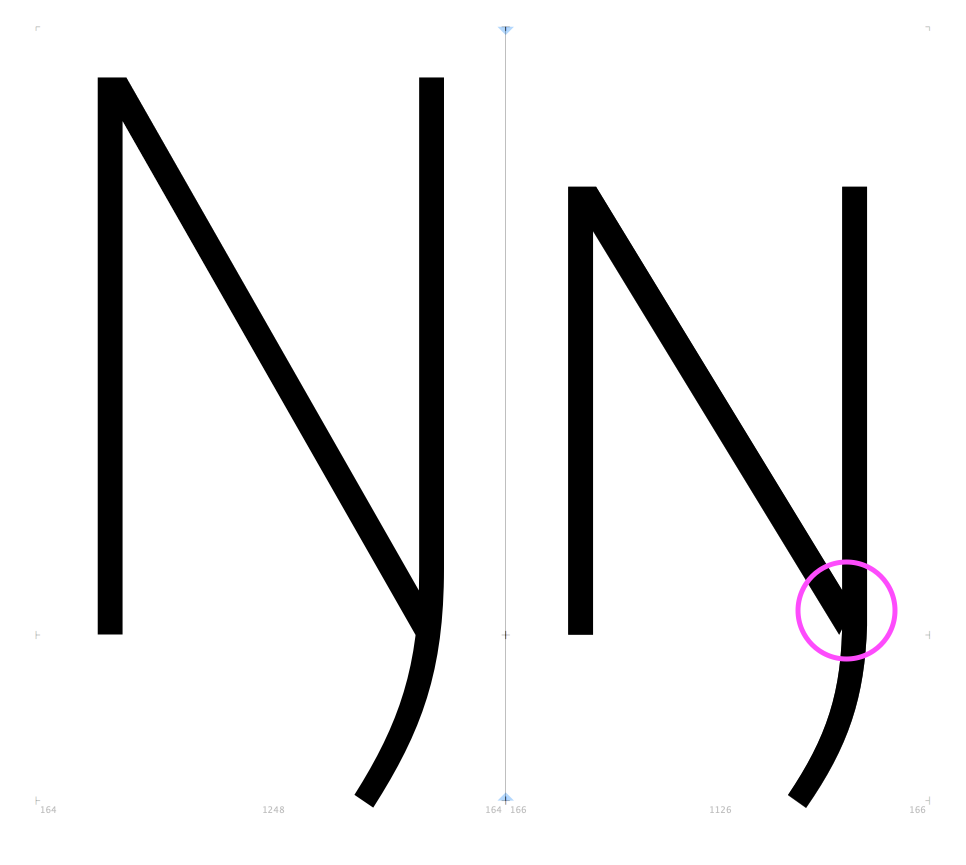

Fixed: 

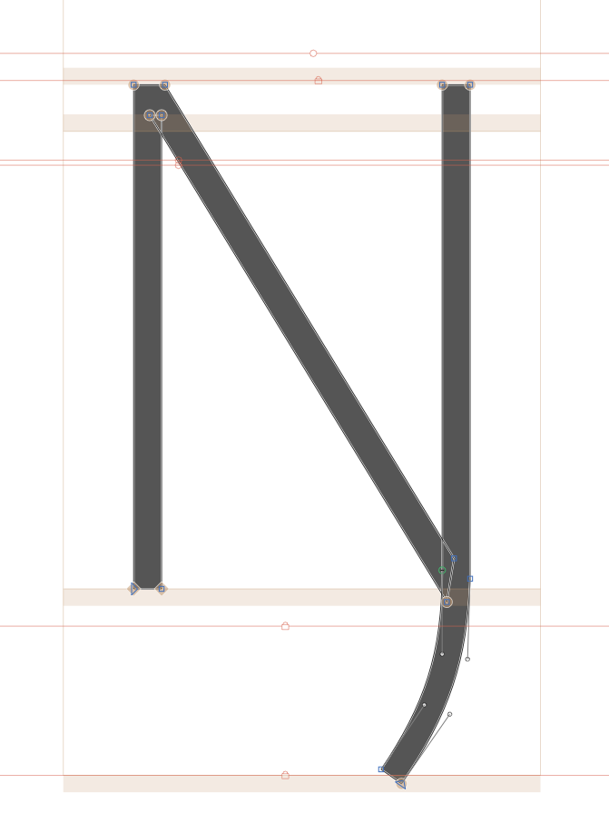

## Making ogoneks connect a bit more smoothly

The ogonek doesn't connect with the bottom-right of the `/E` as well as it should. It also creates an odd little "kink" in the `/a` and `/u`.

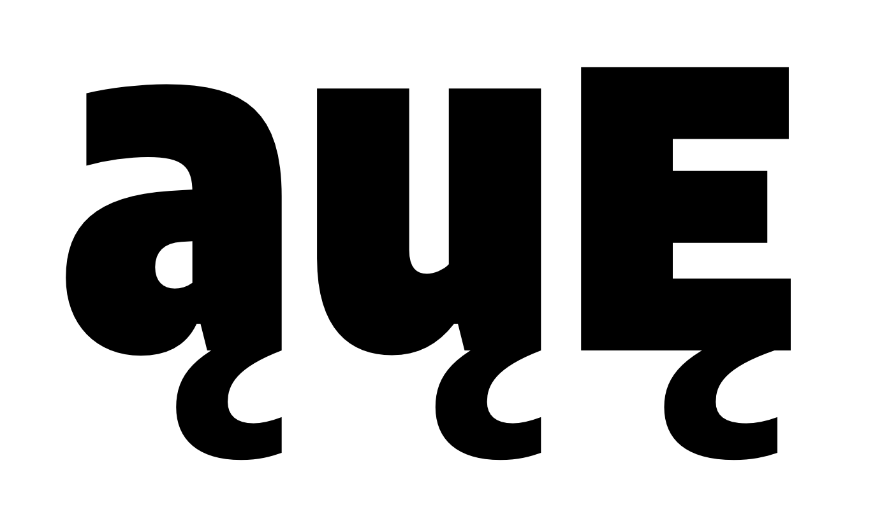

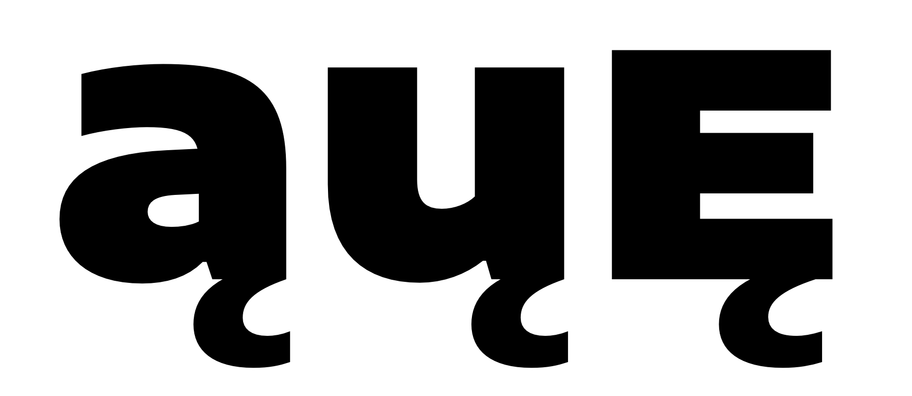

The `/Eogonek` was easily fixed by moving the `ogonek` anchor to the corner. The `/aogonek` and `/uogonek` were resolved by decomposing the base letters, then moving their points down into the ogonek slightly. 

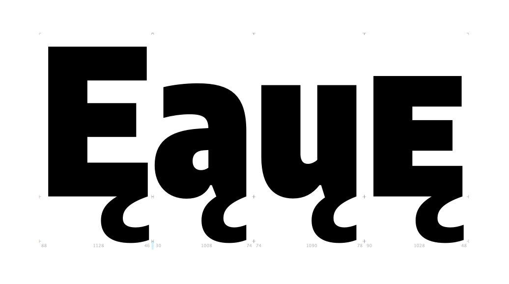

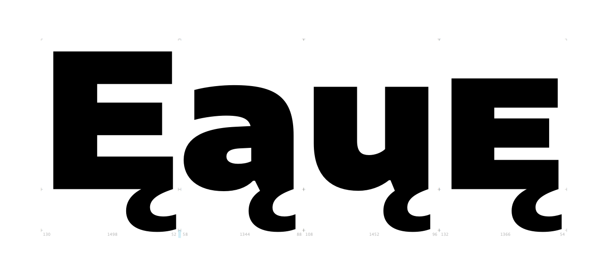

## Making diagonal accents match the sharpness of other diagonals in typeface

Encode Sans has a sharp and precise aesthetic, with (almost) all terminals and diagonals ending in vertical or horizontal terminations, in letters (like `/a /c /e /s`) and in other marks (like `/slash /fraction`). This links it to classic humanist typefaces like Gill Sans, Frutiger, and Verdana. However, the diagonal accents in letters like `/Oslash` and `/lslash` end in angled, "square capped" terminals. 

Potentially, a few other diagonals might be better with sharp terminals, as well. Likely arrows. I'm less certain about math symbols like `/notequal`, as `/multiply` obviously shouldn't have flat terminals.

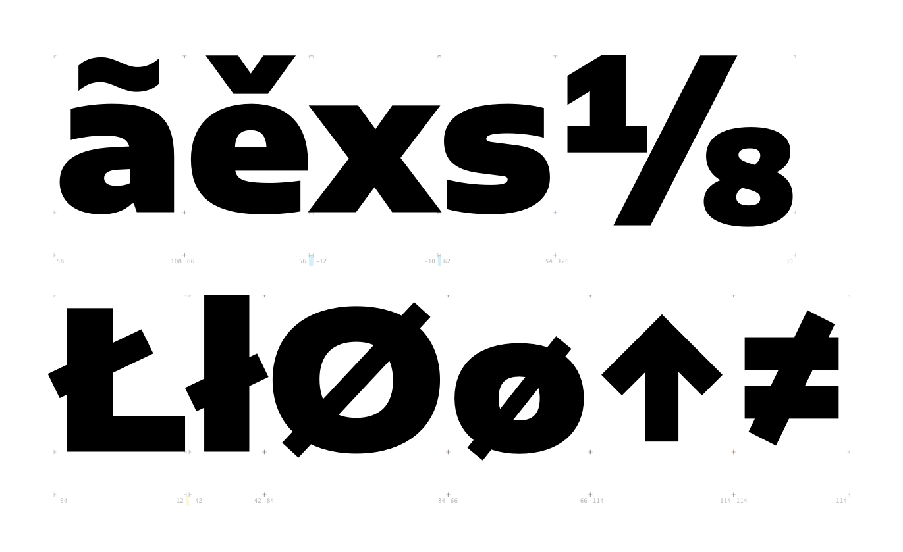

Jacques tried to change it quickly, and showed that in order to change this well, it will be necessary to also consider changing the angle of these strokes.

**`/Lslash` and `/lslash`**

For the `/Lslash` and `/lslash`, I kept the angle of the slash and kept the overall location of the slash on the `L`s. 

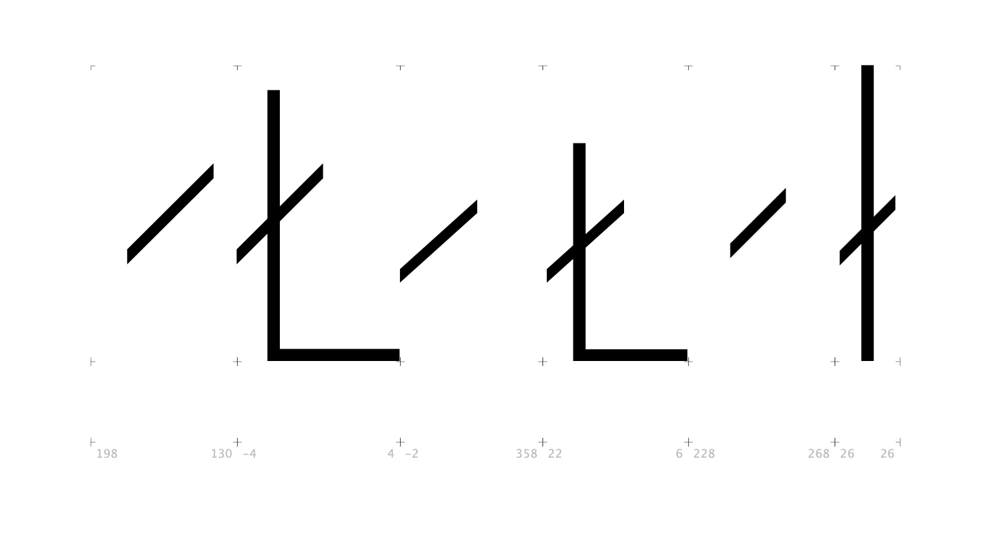
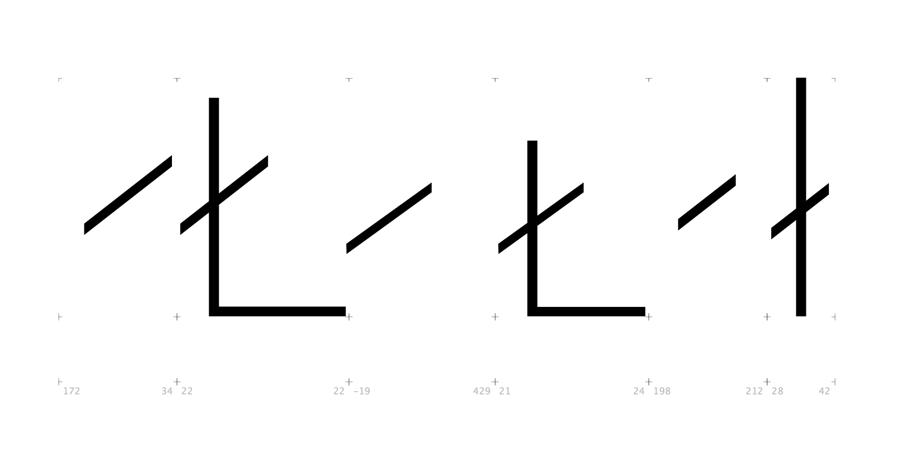
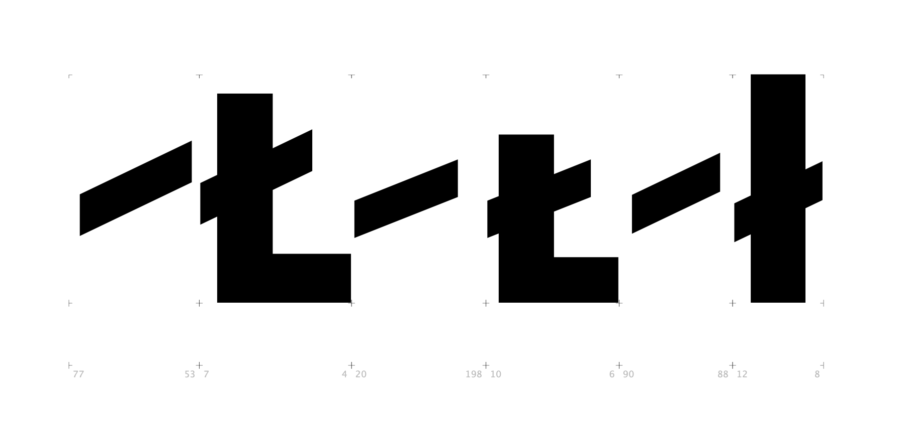
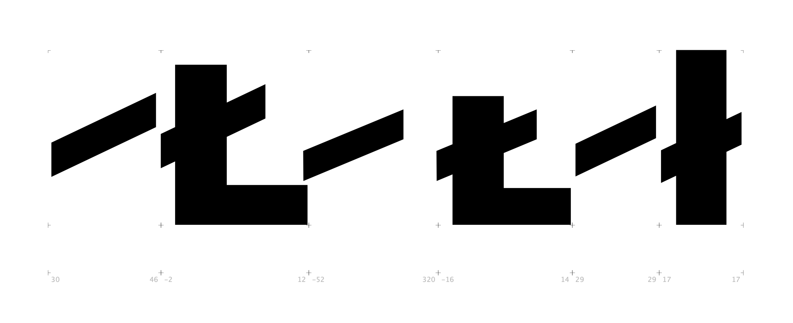

## Still to be completed

- [ ] `/Germandbls`: check kerning, probably add against `/W /Y /V` and punctuation
- [ ] fix diagonal accent terminals