# QA methods outside of FontBakery and GFRegression

Approaches:
- Use FontLab6's "FontAudit," which checks for issues in glyph paths
- Use the GlyphsApp plugin *Red Arrows* to check for issues in glyph paths

## FontLab?

I've been asked to look into additional QA testing in FontLab, so I've done a bit of digging.

So far as I can tell, the only built-in QA testing in FontLab is "FontAudit," a tool somewhat similar to the Red Arrows plugins from GlyphsApp and RoboFont.

[I asked on the FontLab forum](https://forum.fontlab.com/fontlab-vi/are-there-qa-checks-besides-fontaudit/) whether there are additional QA-testing tools. It sounds like [FontQA](http://www.fontqa.com/) is a tool that can be useful, though according to Luc(as) de Groot, this works in FontLab5.

## Checking Red Arrows in GlyphsApp versus FontAudit in FontLab VI

To better understand the differences between outline checking in Glyphs and FontLab, I'll run the two apps side-by-side, checking through lowercase glyphs `/a` through `/z`.

I'll make fixes to flagged issues, along the way.

### Similarities

- Generally, both Red Arrows and FontAudit have arrows pointing out possible issues in glyph outlines
  
- In the Condensed Light and Expanded Bold versions of `/a`, both point to an "Incorrect Smooth Contour" issue ... which is really a non-issue, in this case (it is visually smooth)
    - This was an actual issue in the `/J`, `/j.sc`, `/eng`, and `/j.sc`, which was good to catch

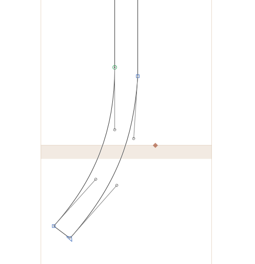

- Both Red Arrows and FontAudit flag the "Collinear vectors" of the Condensed Light `/y` – control points on an otherwise straight line. This could be an issue if they weren't needed, but they *are* needed in other masters, so removing them would actually make the glyph incompatible for interpolation.

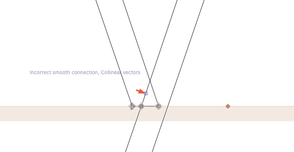t

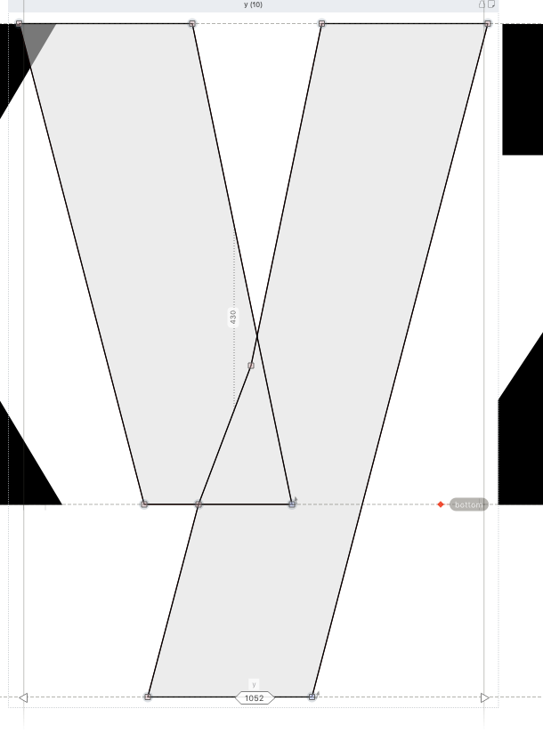

- Both flag the `/at` glyph for a non-vertical point in the Expanded Bold master

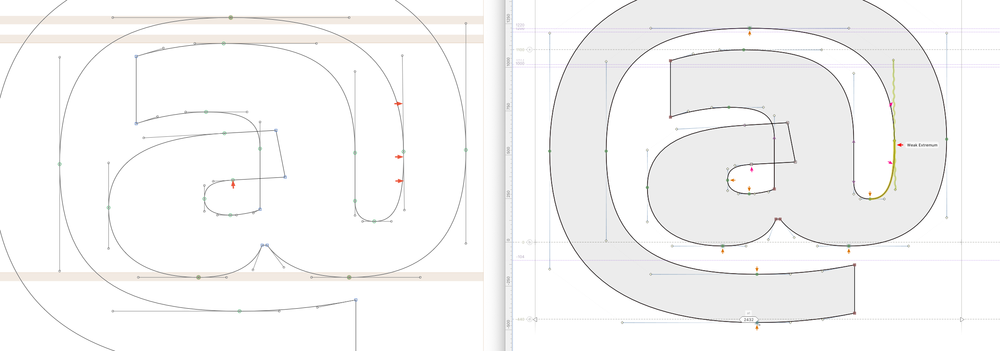

- Both flag nearly-vertical paths in glyphs like `/exclam` and `/question`. Mostly, these aren't an actual issue in Encode, because the Light masters have many glyphs with slight slopes, like the `/t /exclam /quote`.
    - `/pi` did have an issue, which is now fixed 
    - `/uni20VF` (bitcoin symbol) had tilts, just on one master. Another good one to fix.
    - Many nearly-vertical paths are just the inside-corners of glyphs, and therefor just fine
    - 

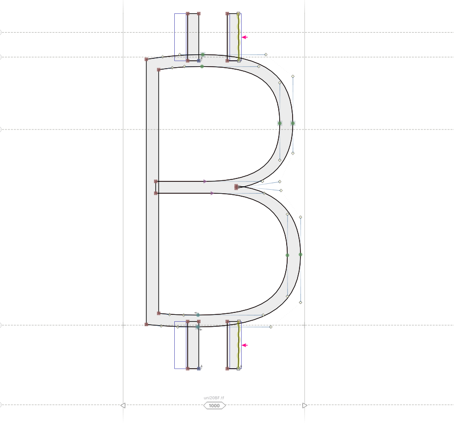

- Both flag "missing" extrema points. Many of these are very slight issues on the curved edges of bowls, from handles that are just *not quite* vertical
    - the `/Q` for not having a point at the extreme at the bottom of its curve. This probably isn't an issue because it's a very slight curve, and covered by the tail, but I added it anyway.
    - The `/integral` is flagged, but this is so slight, I don't think it's a big issue. In fact, when extrema *are* added here, they are so close to the existing points, they cause slight kinks in interpolated instances.
    - `/rupeeIndian` fixed
    - `/five` and five in `.dnom` and `.numr` fixed
    - `/eth`
    - `/germandbls` on inside curve
    - `/g.sc` in expanded light
    - `/guarani` in expanded bold

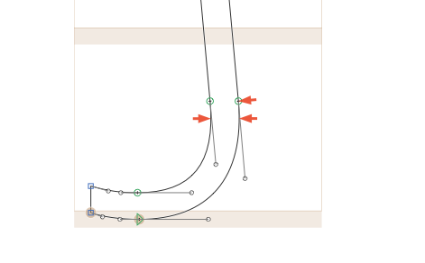

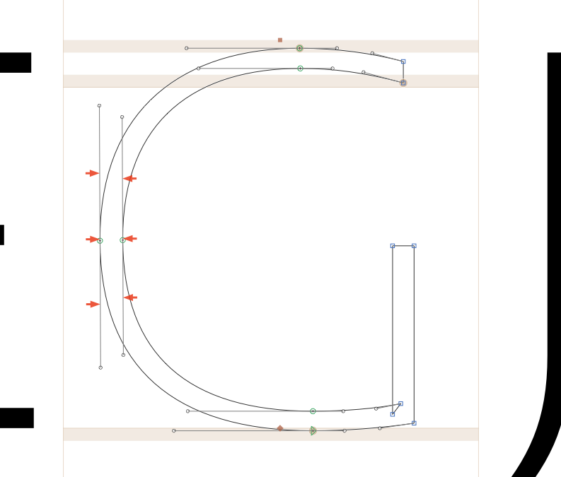

- Both flag inflections. These occasionally cause problems, as discussed in [this TypeDrawers thread](https://typedrawers.com/discussion/2719/why-are-inflections-bad). The main issues are A) conversion to TTF (quadratic) outlines, and B) potential problems in variations. I'll check for these issues in FontView, to see whether they need fixing.
    - The `/tilde` does get a bit narrow in the middle, around the center width, center weight. I've added some inflection points here, but it doesn't make too much of a difference. But, at least it doesn't cause kinks.
    - `/infinity` looks fine
    - `/approxequal` looks fine
    - `/hookaccentcomb` looks fine. It does get a bit more contrast than other glyphs in the font, but this seems somewhat inevitable, with such a tight little hook.
    - `/florin` had one on the top and bottom hooks. Fixed.
    - `/Ohorn` in all cases did, but it looks fine
    - `/P` has a slight inflection in the connection of the bowl to the stem (and then a "nearly horizontal handle"      ). It's very minor, but a good fix. It's in related glyphs, like `peseta.tf`, `/Thorn`, etc.
    - `/t` and related glyphs, in the hook

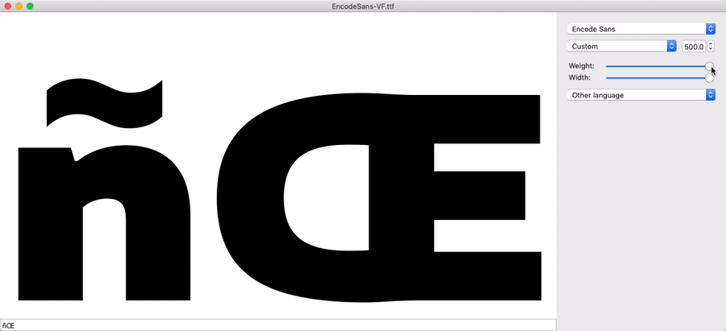

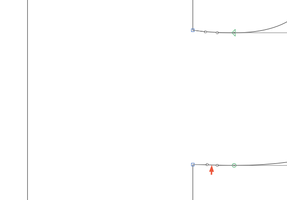

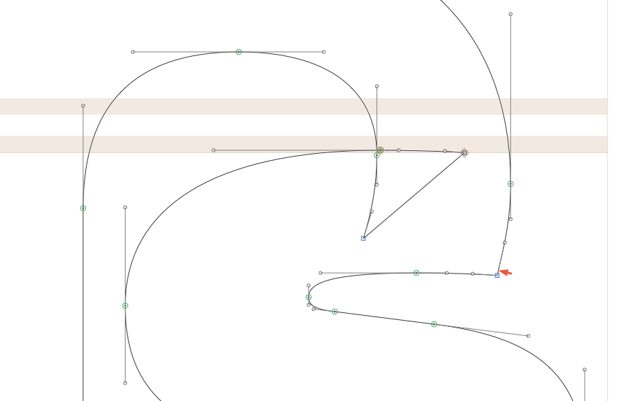

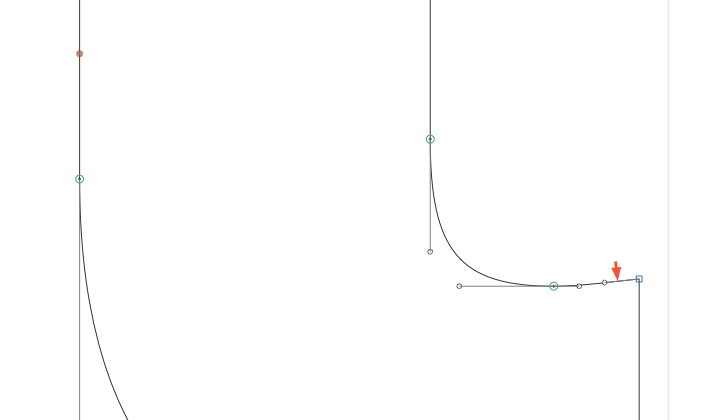

### Differences

- FontAudit offers an auto-fix option, which makes suggested corrections take just one click to resolve. This sounds awesome and kind of is, but ... I'm still worried to try to save a .glyphs file in FontLab, so I'll make the changes in GlyphsApp, anyway.

- FontAudit points to points of curvature that aren't quite located at the spot that would make the curve as smooth as possible. It will auto-fix these, in the case of letters /a–/d, by moving a few oncurve points by about 1–5 units. Is the result better than before? Honestly, I don't really see much of a difference, *except* that paths which formerly appeared monolinear now appear a bit out-of-alignment, or they end up looking just a bit unbalanced when auto-fixed. From what I see, the previous designers of this font did an excellent job of making smooth paths, already.

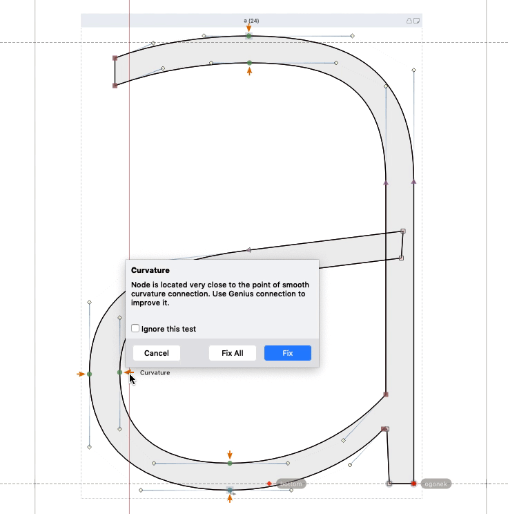

- FontAudit shows the issue "kink in variation," which is really important to find and would be and difficult to catch otherwise. 
    - However, a check in FontView shows that the `/eight` (in lining and superior/inferior forms) doesn't actually appear to have this issue in a visible way.
    - `/servicemark` 

- The best thing I've found about FontAudit so far: it gives a "global view" of outline issues, so you can use arrow keys to navigate through the font-view panel, and see what issues are flagged inside any given glyph.

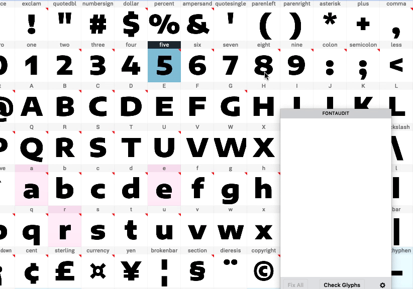

...but as it turns out, Red Arrows offers this, as well: you can use *Edit > Select Glyphs With Outline Errors* to select all glyphs with outline errors, then mark them or open them in a new tab.

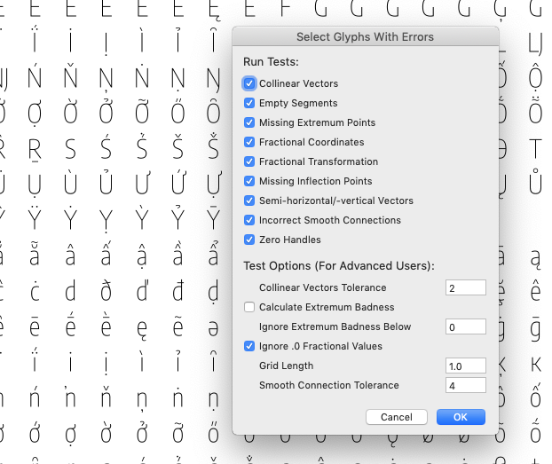

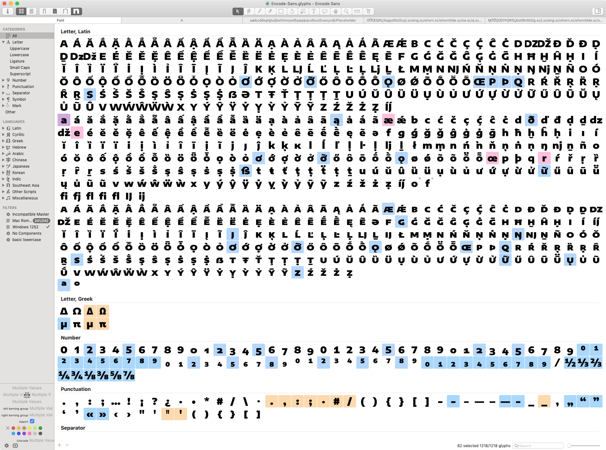

**BUT** Red Arrows selects *different glyphs* in different masters, whereas FontAudit flags errors across all masters. However, I suppose I could just open a tab for each master, to fix errors.

- FontAudit flags "not horizontal" lines
    - `/ordfeminine` has this, but it's not a real issue

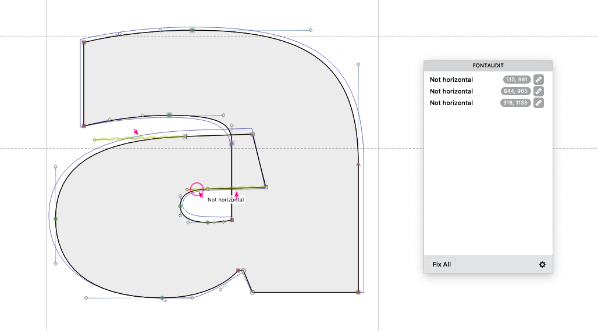

- FontLab VI offers a built-in variation preview tool, which makes it easy to immediately check how bad any "variation kinks" might be.

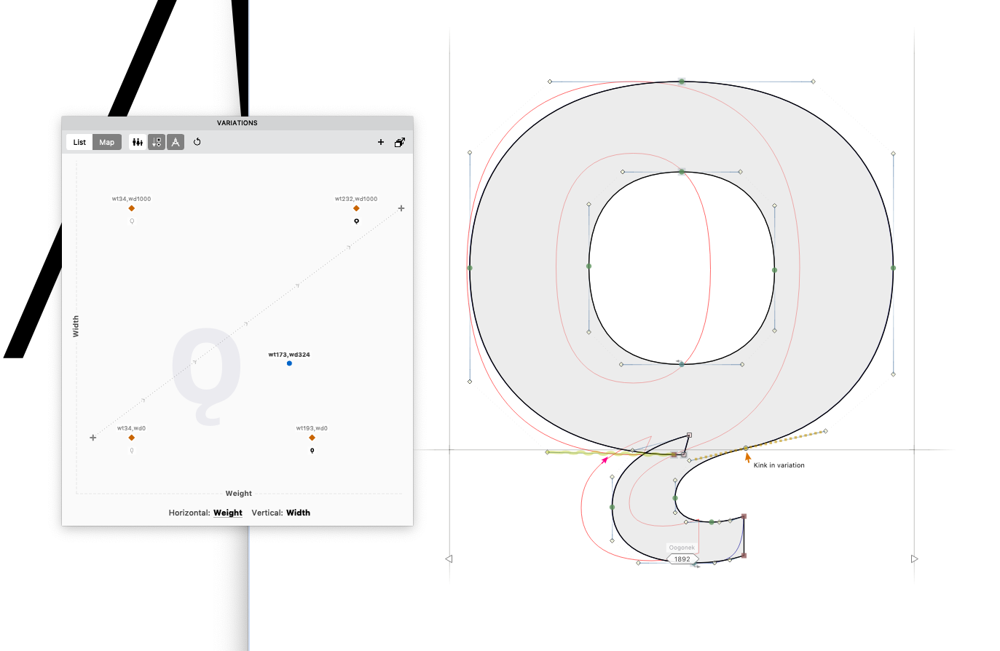

