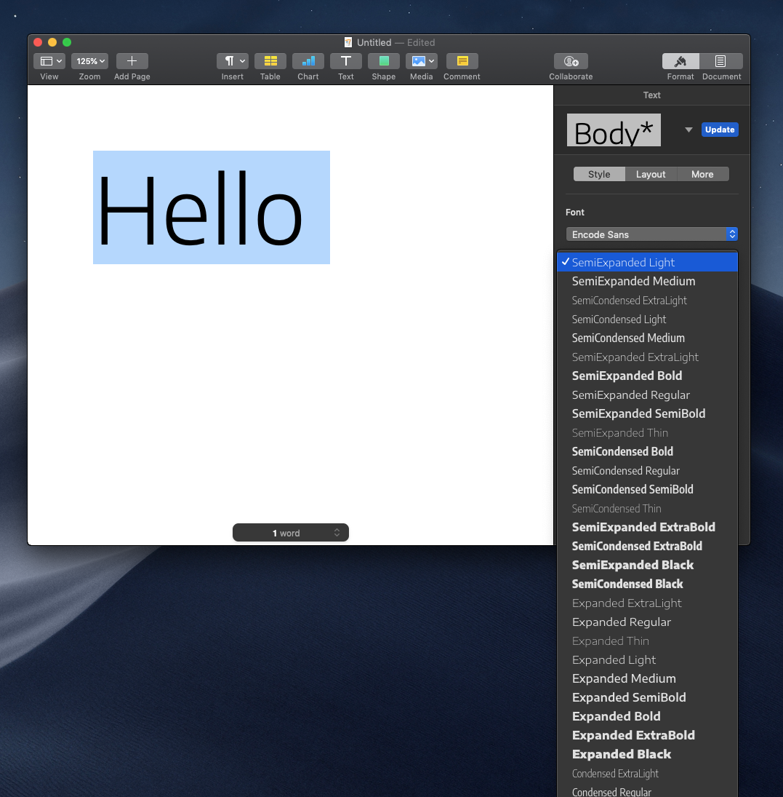
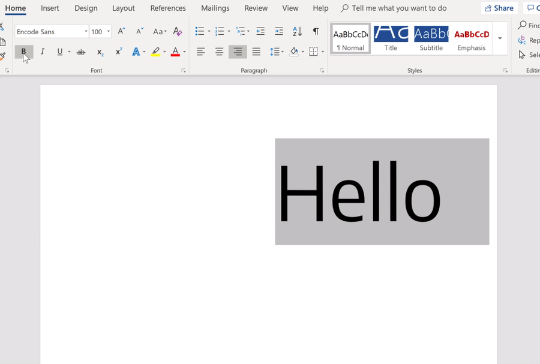
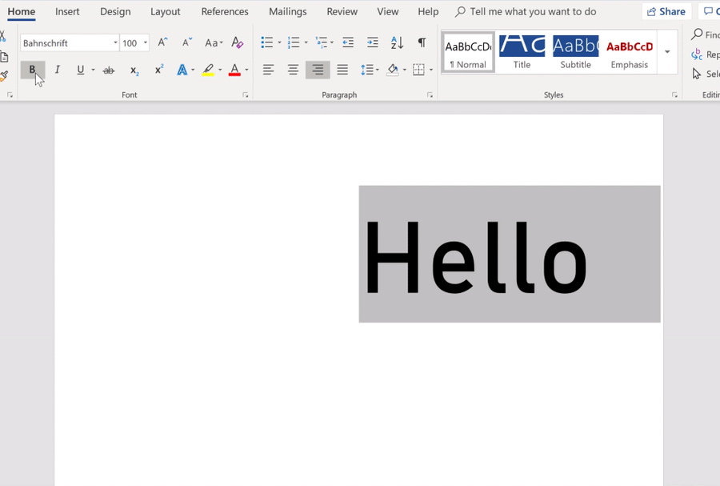
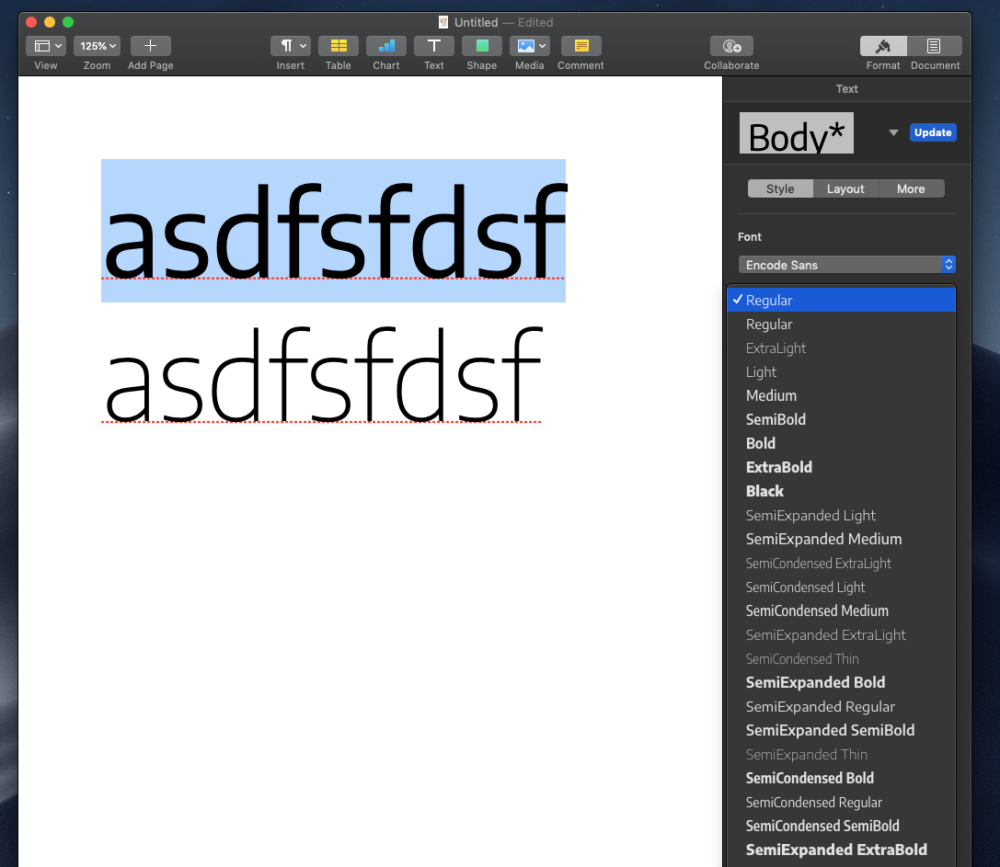
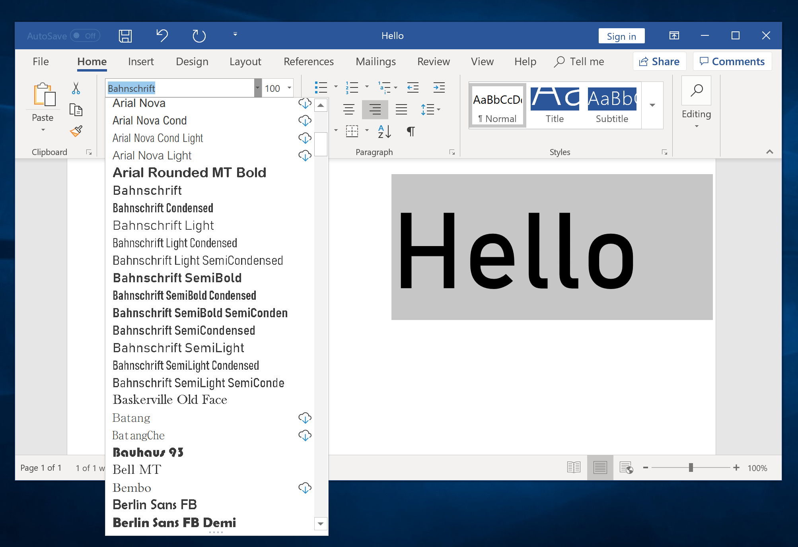
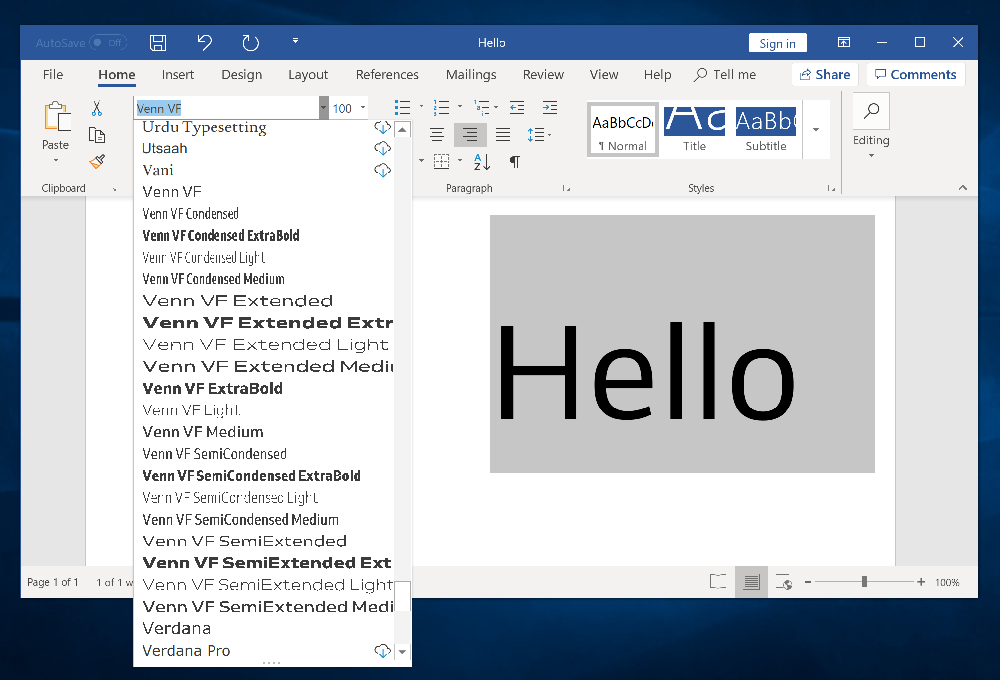
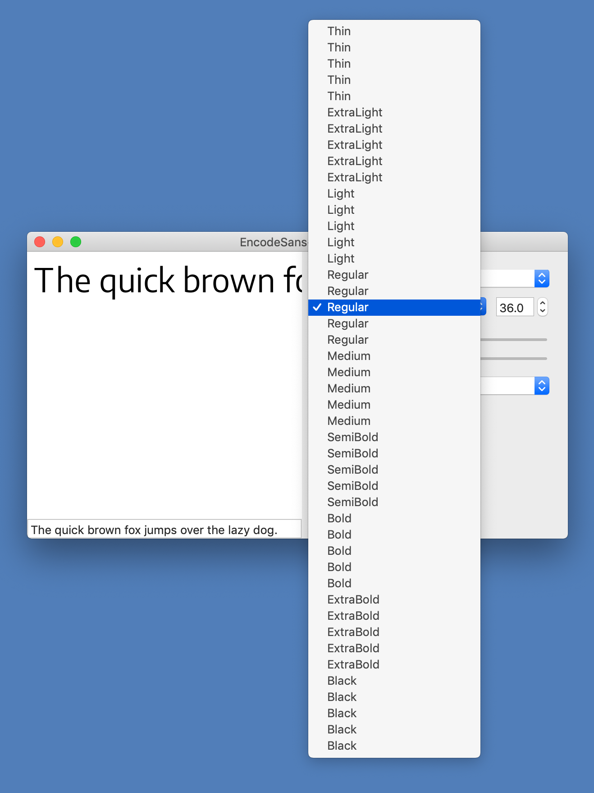
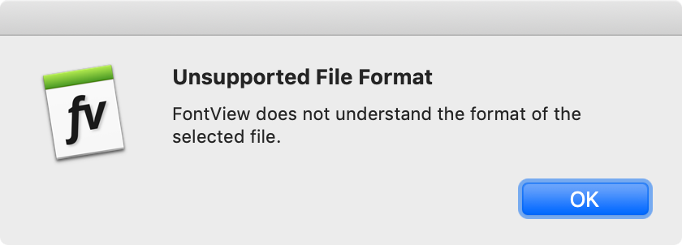

# Testing in software and refining fonts

In MS Word and Apple Pages Font instances were arranging first by weight, then by width. This was a very unhelpful arrangement. So, I'm seeing whether changing the NAME table patch might correct this. I'm switching names from a format of `ExtraLight SemiCondensed` to `SemiCondensed ExtraLight`. This might also make sense to change in the GlyphsApp source. 

Changing just the font's NAME table does help organize things better in Apple Pages, but doesn't work how I'd like in MS Word.

Encode Sans VF in Apple Pages:

Encode Sans VF in Microsoft Word:

## Making names better

Based on a TTX of Bahnschrift, an open-source font packaged with Windows, the nameID 4 and 6 doesn't need to include the default weight name. Bahnschrift is simple `Bahnschrift` for both IDs. Additionally, unlike the NAME patch I was using, the `platform="1"` elements in the `<name>` table don't have every style name declared (though they are for `platform="3"`/Mac). These changes may help it to show up in font menus in a more-straightforward way.

.....aaaand they actually do make a difference! The fonts are now showing up in MS Word with the ordering I want, as well as all the styles I expect. 

## Style Linking

One strange thing about Encode Sans in MS Word is that the Regular–Bold style linking works ... but the line height jumps substantially when the Bold style is used.

This doesn't happen in Bahnschrift:

- [ ] TODO: check [Saira](https://github.com/m4rc1e/Saira-1/tree/master/SairaGF/sources) as a possible good weight + width VF reference.

## Name table improvements

I'm using Bahnschrift and the MS Typography docs to upgrade my `NAMEpatch.xml` file slightly.
- I've changed `nameID 2` to "Regular," as this is subbed in for `nameID 17`: "Preferred Subfamily. No name string present, since it is the same as name ID 2 (Font Subfamily name)". This should hopefully make the Regular named instance be used as the default in some apps, rather than the Condensed Thin style.
- I'm changing `nameID 2` from `2.000;GOOG;EncodeSans-ThinCondensed` to `2.000;GOOG;EncodeSans`
- I've changed `nameID`s 4 & 6 to simply `Encode Sans`, from `Encode Sans Condensed Thin`, so it avoids name-length issues and hopefully shows up more simply in font menus
- I've also added specific sample text to `nameID` 19, for display in font-viewing apps.

- [ ] TODO: Check if name patches need to exist for weight-split / linked variable fonts

## Sorting on Mac

Currently, the named instance "Regular" is the default style in macOS pages (good) ... but it's also the first to show up in macOS Pages font menu, when I would expect "Condensed Thin" to be the first to appear, and "Thin" itself doesn't show up until the last place of the menu (bad).

## Do *any* weight & width variable fonts sort well in font menus?

I'm not passing judgement or putting down anyone else's work, but I just want to know: are any of the fonts I think of as "setting the standard" working how I expect in font menus? If they are, I can emulate their NAME and STAT tables. If they aren't, it would seem to be an indication that the issue is at the software application level, more than the font side.

**Bahnschrift, from Microsoft**

- 👍 This starts with the default style (which appears to be Normal width, Regular weight)
- 🚫 It groups by weight, rather than width
- 🚫 The ordering of weights isn't predictable (Light, SemiBold, then SemiLight)
- 🚫 The widths within weights aren't what I would expect (normal, Condensed, then SemiCondensed)

**Venn VF, from Dalton Maag**

- 👍 This starts with the default style (which appears to be Normal width, Regular weight)
- 👍 It groups by width
- 🚫 The ordering of widths isn't predictable (Condensed, Extended, normal, SemiCondensed, then SemiExtended)
- 🚫 The weights within widths aren't predictable (Regular, ExtraBold, Light, Medium)

## Getting the NAME and STAT tables correct

I had started building with patches for the NAME and STAT tables, but I may have messed them up while working to improve font menu sorting. MS Typography has a helpful example of the STAT table for a weight + width variable font here:
https://docs.microsoft.com/en-us/typography/opentype/spec/stat#example-4-a-weightwidth-variable-font

Earlier, I hadn't understood the linked-purposes of the NAME & STAT tables. Now I'm beginning to wrap my head around it: the NAME tables provide strings necessary for naming, while the STAT table connects those strings to actual values in the font. 

## Checking the NAME and STAT tables in weight + width variable font
- [x] try without patches – are they necessary?
    - the NAME patch is definitely necessary, otherwise styles will all have weight-only names, due to the GlyphsApp instances configuration

    - Meanwhile, the STAT table only has entries for the two axes, but none that correspond to named instances. This is a problem, because MS Typography says, "Suppose the variable font has 6 named instances that correspond to three different weights for each of two widths. The style attributes table should include axis value records for at least those three weights and those two widths, but could also include records for other weight or width values."

    - *However*, generating a fresh font helps me see things that were incorrect in my NAME table patch. It was missing nameID `0`, for Copyright, and nameID `7`, for Trademark.

- [x] try when "Axes" custom parameter is added to GlyphsApp source
    - this appears to have no impact on the VF built via FontMake. The NAME table still has weight only names (though I never expected this to be different), while the STAT table stil has only two entries (I did hope this might be affected)

- [x] edit tables to match MS typography recommendations
- [x] in NAME table, make sure `platformID` and `platEncID` match: `1` & `0` for Mac, `3` & `1` for Windows
- [ ] fix messed-up values in STAT table, which are breaking the build
    - (There were typos in certain "format" fields, mostly)

    - Actually, MS Typography says: "***axisOrdering:*** A value that applications can use to determine primary sorting of face names, or for ordering of descriptors when composing family or face names." So, that might be the only required change

- [ ] compare TTX outputs
- [ ] try each in Word & Pages

## Checking the NAME and STAT tables in weight-only variable font
- [ ] try without patches 
- [ ] try with patches
- [ ] compare TTX outputs
- [ ] try each in Word & Pages
