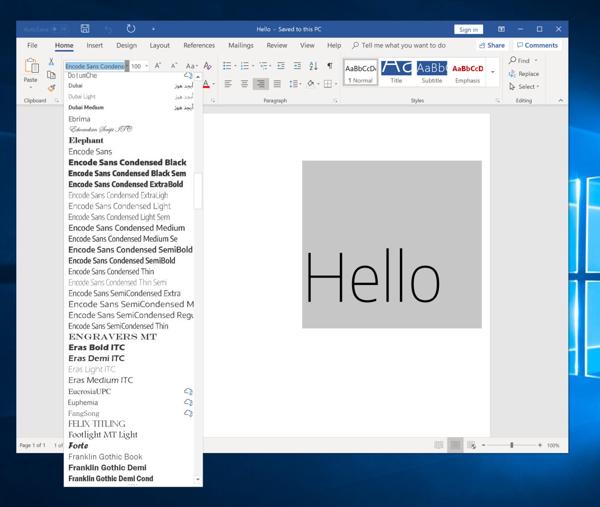

# Testing in software and refining fonts

In MS Word and Apple Pages Font instances were arranging first by weight, then by width. This was a very unhelpful arrangement. So, I'm seeing whether changing the NAME table patch might correct this. I'm switching names from a format of `ExtraLight SemiCondensed` to `SemiCondensed ExtraLight`. This might also make sense to change in the GlyphsApp source. 

Changing just the font's NAME table does help organize things better in Apple Pages, but doesn't work how I'd like in MS Word.

Encode Sans VF in Apple Pages:

Encode Sans VF in Microsoft Word:

## Making names better

Based on a TTX of Bahnschrift, an open-source font packaged with Windows, the nameID 4 and 6 doesn't need to include the default weight name. Bahnschrift is simple `Bahnschrift` for both IDs. Additionally, unlike the NAME patch I was using, the `platform="1"` elements in the `<name>` table don't have every style name declared (though they are for `platform="3"`/Mac). These changes may help it to show up in font menus in a more-straightforward way.

.....aaaand they actually do make a difference! The fonts are now showing up in MS Word with the ordering I want, as well as all the styles I expect. 

## Style Linking

One strange thing about Encode Sans in MS Word is that the Regular–Bold style linking works ... but the line height jumps substantially when the Bold style is used.

This doesn't happen in Bahnschrift:

- [ ] TODO: check [Saira](https://github.com/m4rc1e/Saira-1/tree/master/SairaGF/sources) as a possible good weight + width VF reference.