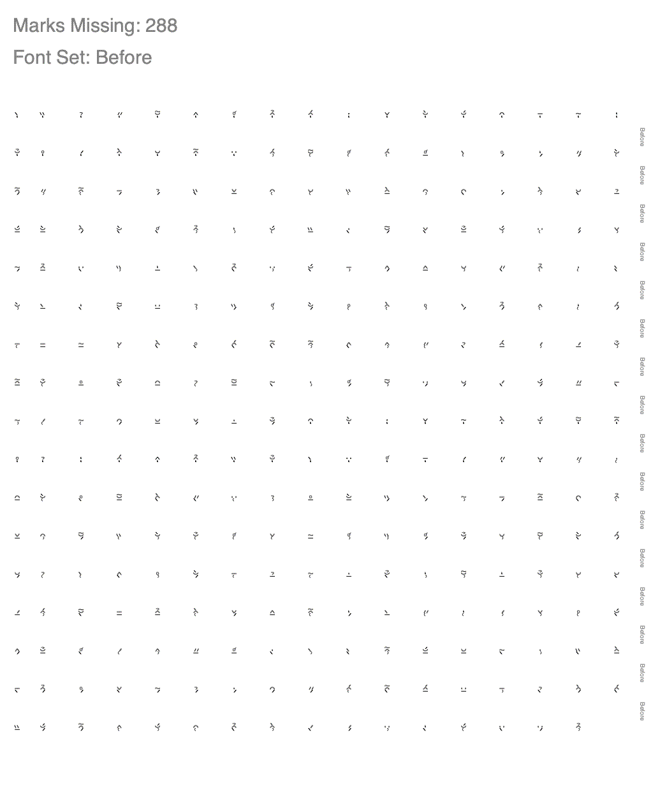

# Diffing Against Old Static Fonts

Variable fonts need to be introduced with minimal disruption to websites that use currently-published static versions of fonts.

To accomplish this, Google Fonts has various tools to test "diffs" (differences) between fonts. I'll be using these to check my newly built versions of Encode Sans, and make sure I haven't introduced and changes that shouldn't have been introduced.

## Diffenator

[Diffenator](https://github.com/googlefonts/fontdiffenator): "Python 3 library/tool to compare two TTF fonts against each other. It's capable of producing diff images using Harfbuzz, Cairo and FreeType. It can also produce Markdown reports for Github."

Once installed, it's used with a command like:

```
diffenator EncodeSans-VF.ttf old/EncodeSansCondensed-Light.ttf -r out
```

### Diffenator problems caught

**Mark-to-mark positioning**

Currently, the most obvious problem caught by the Font Diffenator are seemingly-broken stacked accent marks:




**Style naming**

If I try to test Condensed against Condensed fonts, I use the following command:

```
diffenator EncodeSansCondensed-VF.ttf old/EncodeSansCondensed-Light.ttf -r out
```

However, I get this error:

```
Exception: Instance "Condensed Light"" not found in fvar instances. Available [Thin, ExtraLight, Light, Regular, Medium, SemiBold, Bold, ExtraBold, Black]
```

I need to find whether this is actually a problem of the font, and whether it will disrupt any programs besides Font Diffenator.

Actually, according to Marc, this might not necessarily be a big issue.

One thing that did help: I used a VF that I had updated style names on, putting the Width description before the weight description. This was to help it better work in font menus of apps like MS Word, but it seems to fix this problem, as well. 


- [ ] Check / fix mark2mark positioning in stacked accents
- [x] Check on style naming