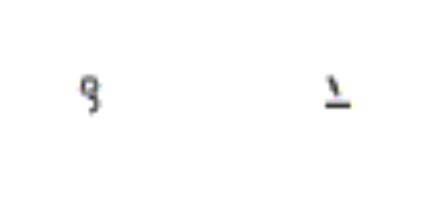
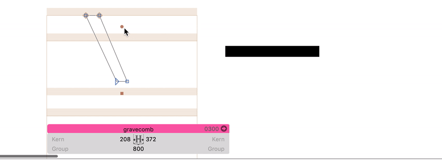

# Diffing Against Old Static Fonts

Variable fonts need to be introduced with minimal disruption to websites that use currently-published static versions of fonts.

To accomplish this, Google Fonts has various tools to test "diffs" (differences) between fonts. I'll be using these to check my newly built versions of Encode Sans, and make sure I haven't introduced and changes that shouldn't have been introduced.

## Diffenator

[Diffenator](https://github.com/googlefonts/fontdiffenator): "Python 3 library/tool to compare two TTF fonts against each other. It's capable of producing diff images using Harfbuzz, Cairo and FreeType. It can also produce Markdown reports for Github."

Once installed, it's used with a command like:

```
diffenator EncodeSans-VF.ttf old/EncodeSansCondensed-Light.ttf -r out
```

### Diffenator problems caught

**Mark-to-mark positioning**

Currently, the most obvious problem caught by the Font Diffenator are seemingly-broken stacked accent marks:


**Style naming**

If I try to test Condensed against Condensed fonts, I use the following command:

```
diffenator EncodeSansCondensed-VF.ttf old/EncodeSansCondensed-Light.ttf -r out
```

However, I get this error:

```
Exception: Instance "Condensed Light"" not found in fvar instances. Available [Thin, ExtraLight, Light, Regular, Medium, SemiBold, Bold, ExtraBold, Black]
```

I need to find whether this is actually a problem of the font, and whether it will disrupt any programs besides Font Diffenator.

# Are these real problems, or false issues?

**Mark-to-mark positioning**

The mark-to-mark test is the most concerning, as these aren't items I have deliberately changed. Before I do too much to change them now, I want to double-check that the differences aren't simply due to one being a variable font, or something else. 

I wanted to look at two specific examples to test the overall test. Lets isolate a `/ringhalfright + /ring` and a `/macroncomb + /gravecomb`:



As far as I know, layout programs rely on anchors to position these combined marks. I've gone through accents, paying special attention to `/ringhalfright /ring /macroncomb /gravecomb`, and they each have a `_top` anchor to connect above other glyphs, as well as their own `top` anchor to allow glyphs to connect above themselves.



Still, I need a way to test these marks in a real app, like Pages or Word. (This is possible by using the mac glyphs palette with the key command **control + command + space**, then searching "comb").

For the most part, it seems to work quite well!


The "comb" characters stack just fine. However, I am having trouble getting the `/ringhalfright` of Encode to stack (a fallback font takes over). 

I need to ask a few people how I might best handle this, and if there is a character naming standard that might make this work as desired.


**Style Naming**

According to Marc, this might not necessarily be a big issue, as the name-matching algorithm is simply hard to write to work for any arbitrary font.

One thing that did help: I used a VF that I had updated style names on, putting the Width description before the weight description. This was to help it better work in font menus of apps like MS Word, but it seems to fix this problem, as well. 


- [x] Check / fix mark2mark positioning in stacked accents
- [x] Check on style naming

